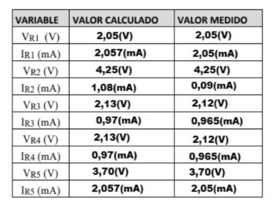
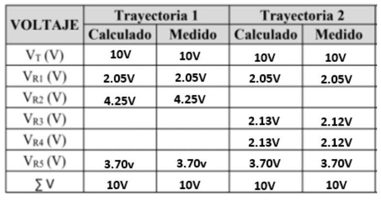

InformeLaboratorioNo1
==========================
# PRÁCTICA No. 1 LEYES DE KIRCHHOFF
1. OBJETIVOS
* 1.1 OBJETIVO GENERAL

Resolver y diseñar circuitos eléctricos básicos empleando sus leyes y principios fundamentales, generando una actitud reflexiva, analítica, creativa y ordenada 
Para repasar todos estos conceptos se recomienda usar la información del CAP1 V4.0 de laboratorio de circuitos eléctricos. Analizar el papel que los simuladores de circuitos electrónicos juegan en el proceso de enseñanza-aprendizaje en las materias de Fundamentos de Circuitos Eléctricos de la Rama de Electricidad y Electrónica

* 1.2 OBJETIVOS ESPECIFICOS
  * Controlar el uso de diferentes componentes de simulación de circuitos eléctricos como: Protoboard, Multímetro, Resistencias, Suministro de energía.
  * Conocer los siguientes conceptos básicos de electricidad: corriente eléctrica, magnitudes fundamentales, ley de Ohm, leyes de Kirchhoff y circuitos eléctricos.
  * Poner en práctica los conocimiento de circuitos eléctricos.

2. REQUISITOS PREVIOS
  * Tener conceptos  básicos para el uso  de instrumentación. 
  * Saber definición de varios componentes eléctricos. 
  * Manejo básico del simulador de circuitos tinkercad.
  * Saber ley de Ohm y leyes de Kirchhoff para resolver el circuito. 
	
3. INFORMACION GENERAL 

Los simuladores de circuitos electrónicos son muy útiles para explicar el comportamiento de éstos de una forma asequible a los alumnos de la rama de Eléctrica y Electrónica.
El uso de la simulación por ordenador es una herramienta imprescindible hoy en día a la hora de explicar la electrónica en el aula, al ser la forma más sencilla y rápida de comprobar el funcionamiento de un circuito. Además, no necesita ningún tipo de material adicional para el montaje del mismo o medida de los resultados. A lo largo de este trabajo de laboratorio se medirá y calculara valores tanto de voltaje, intensidad y resistencia por medio de los instrumentos del mismo simulador y aplicando las leyes de ohm y Kirchhof.

4. MATERIAL Y EQUIPO REQUERIDO

| Cantidad | Material o Equipo | 
| --------- | --------- | 
| 1 | Fuente de Voltaje de C.D. | 
| 2 | Multímetros Digitales | 
| 1 | Resistor de 1 KΩ |
| 2 | Resistores de 2.2 kΩ | 
| 1 | Resistor de 1.8kΩ | 
| 1 | Resistor de 3.9kΩ | 
| 1 | Protoboard | 

5. PROCEDIMIENTO

### 5.1 Arme el circuito que se muestra en la figura 1.1.

 
 
Figura 1.1. Circuito Resistivo Mixto

 
 
### 5.2 Mida el voltaje y corriente en cada uno de los elementos del circuito. Anote los resultados de las mediciones en la tabla 1.1.

Tabla 1.1. Resultados obtenidos de voltaje y corriente, en cada elemento del circuito.

 
### 5.3 Verifique si se cumple la Ley de Kirchhoff de Voltajes en cada trayectoria cerrada, considerando  las  elevaciones  de  voltaje  con  signo  positivo  y  las caídas  de  voltaje  con signo negativo. Anote los resultados en la tabla 1.2.
 
Tabla 1.2. Verificación de la LVK.

SI CUMPLE PORQUE LA SUMATORIA DE VOLTAJE EN LAS RESISTENCIAS ES IGUAL AL VOLTAJE DE LA FUENTE.
 
### 5.4 Verifique si se cumple la Ley de Kirchhoff de Corrientes en cada nodo, tomando con signo positivo las corrientes que entran al nodo y con signo negativo las que salen del nodo. Anote los resultados en la tabla 1.3.
 
Tabla 1.3. Verificación de la LCK.

SI CUMPLE PORQUE LA SUMATORIA DE CORRIENTES EN LOS NODOS ES IGUAL A CERO.
 
### 5.5 Compare los resultados medidos con los valores obtenidos al analizar el circuito analíticamente y concluya al respecto.

Al obtener los valores realizados mediante las fórmulas, obtenemos medidas que se acercan mucho a lo que se obtiene dentro del circuito realizado dentro de tinkercad, no existe una gran diferencia entre cada valor, tanto del voltaje como de corriente, se puede observar en la Tabla 1.1, por lo cual los valores obtenidos son los mismos, eso nos da una nocion de que cada uno de las operaciones realizadas se encuentran correctamente.

6. VIDEO

https://www.youtube.com/watch?v=crRb9tiHhD0

7. CONCLUSIONES

8. BIBLIOGRAFIA

Bueche, Frederick J. y Eugene Hecht. Esquema de la teoría y problemas de la física universitaria de Schaum . Nueva York: McGraw-Hill, 2006. Imprimir.
